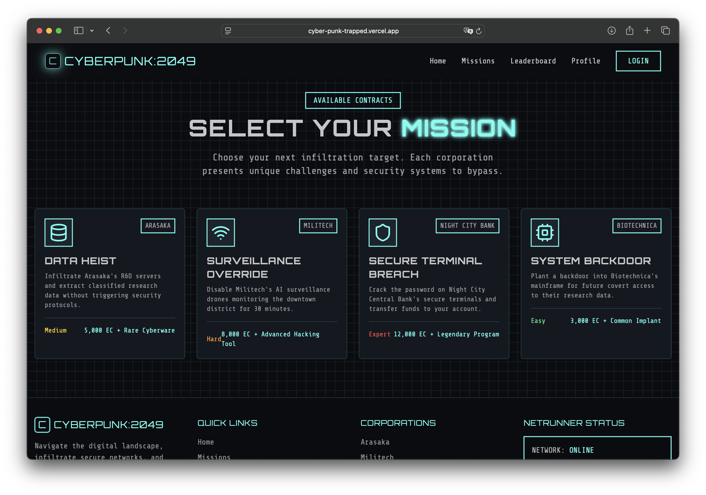
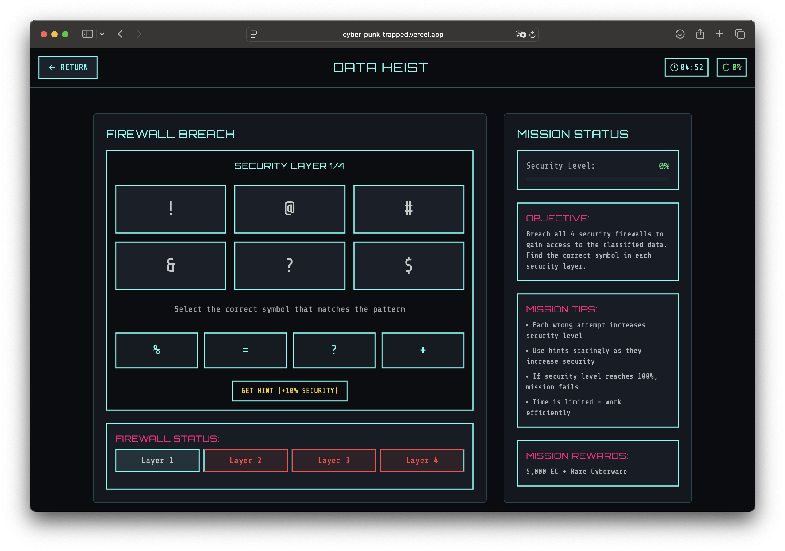
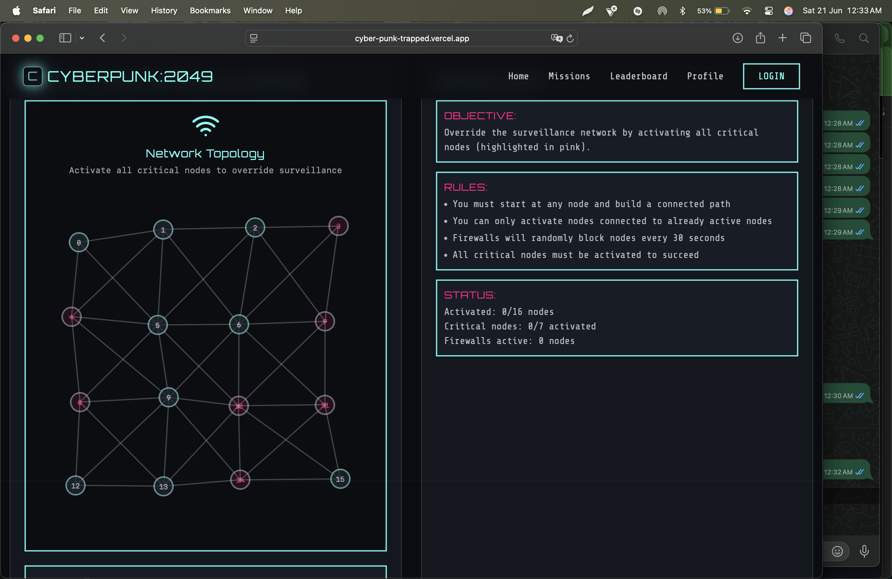
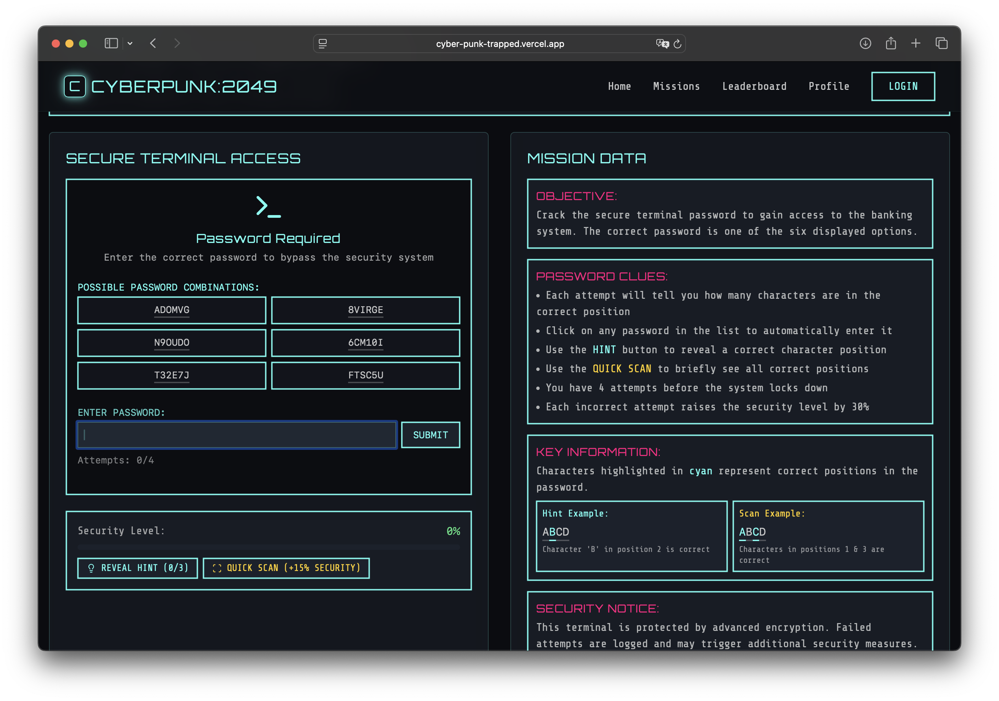
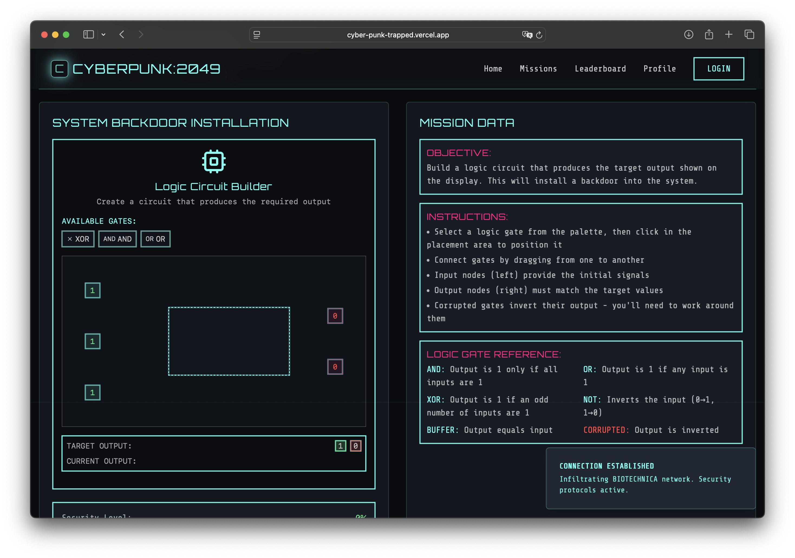

# 🕶️ CyberPunk: Trapped

Welcome to **CyberPunk: Trapped** — a thrilling, immersive hacking game set in a futuristic dystopia. Play as a rogue netrunner who infiltrates corporate systems, breaches firewalls, and extracts valuable data, all while dodging digital defenses and rival hackers. This project is built using cutting-edge web technologies including **React**, **TypeScript**, **Vite**, and **Shadcn UI**, delivering high performance and clean modular code to support an engaging cyberpunk experience.

Whether you're a developer interested in the codebase, a gamer curious about how the system works, or a contributor ready to build the future of immersive browser games, this README is your starting point. Dive into the source, understand the structure, and learn how to run, develop, or contribute to **CyberPunk: Trapped**.

---

## 🚀 Live Demo

👉 **Play Now:** [cyber-punk-trapped.vercel.app](https://cyber-punk-trapped.vercel.app)

---


## Screenshots

<p align="center">
  
  
</p>
<p align="center">
  
  
</p>
<p align="center">
  
  
</p>

---

## 📁 Project Structure

```
CyberPunk-Trapped/
├── public/                  # Static assets & screenshots
├── src/                     # Core application source
│   ├── components/          # Reusable UI and game components
│   ├── games/               # Mini-games like CircuitHack, MemoryHack, etc.
│   ├── hooks/               # Custom React hooks
│   ├── lib/                 # Utility functions
│   ├── pages/               # Page-level views (e.g., Index, Missions)
│   └── utils/               # Algorithms like pathfinding
├── index.html               # Main entry HTML file
├── package.json             # Project metadata and dependencies
├── tailwind.config.ts       # TailwindCSS configuration
└── vite.config.ts           # Vite bundler configuration
```

---

## ⚙️ Tech Stack

- React with TypeScript
- Vite for lightning-fast builds and HMR
- Tailwind CSS for styling
- Shadcn UI for prebuilt UI components
- Modular and scalable file structure

---

## 🎮 Game Features

- Mission-based system: Choose from multiple missions with unique objectives.
- Mini-games: Solve hacking puzzles like:
  - CircuitHack
  - MemoryHack
  - NetworkHack
  - TerminalHack
- Live netrunner stats: Real-time display of users online and server load.
- Reward mechanics: Earn EC (Encrypted Credits) and unlock cyberware, implants, and tools.
- Immersive UI/UX: Terminal-style interaction, futuristic UI, and mission feedback.

---

## 🛠️ Getting Started

### 1. Clone the Repository
```bash
git clone https://github.com/Sonal-Jaiswal/CyberPunk-Trapped.git
cd CyberPunk-Trapped
```

### 2. Install Dependencies
Using npm:
```bash
npm install
```
Or using yarn:
```bash
yarn install
```

### 3. Run the App Locally
```bash
npm run dev
# or
yarn dev
```
The app will be available at http://localhost:5173.

---

## 🔐 Available Missions

| Corporation     | Mission Name           | Difficulty | Reward                            |
|-----------------|------------------------|------------|-----------------------------------|
| Arasaka         | Data Heist             | Medium     | 5,000 EC + Rare Cyberware         |
| Militech        | Surveillance Override  | Hard       | 8,000 EC + Advanced Hacking Tool  |
| Night City Bank | Secure Terminal Breach | Expert     | 12,000 EC + Legendary Program     |
| Biotechnica     | System Backdoor        | Easy       | 3,000 EC + Common Implant         |

---

## 📚 Configuration Files

| File              | Purpose                           |
|-------------------|-----------------------------------|
| package.json      | Dependencies and scripts          |
| tailwind.config.ts| Tailwind CSS customization        |
| vite.config.ts    | Vite bundler config               |
| tsconfig.json     | TypeScript settings               |
| .gitignore        | Ignored files/folders for Git     |
| eslint.config.js  | Code linting rules                |

---

## 🤝 Contributing

We welcome contributions!

- Fork the project
- Create your feature branch: `git checkout -b feature/YourFeature`
- Commit your changes: `git commit -am 'Add your feature'`
- Push to the branch: `git push origin feature/YourFeature`
- Open a Pull Request

Please ensure your code follows the coding guidelines and is tested before submission.

---

## 📄 License

Distributed under the MIT License. See LICENSE file for more information.

---

## 👤 Maintainer

**Sonal Jaiswal**  
GitHub: [@Sonal-Jaiswal](https://github.com/Sonal-Jaiswal)

---

## 📬 Contact

For bug reports, feature requests, or security issues, please open an issue on the GitHub repo.

---

## ⭐️ Support

If you like this project, leave a ⭐️ on the repo and share it with fellow cyberpunks!

> “The future is just a hack away. Stay connected. Stay anonymous.”
