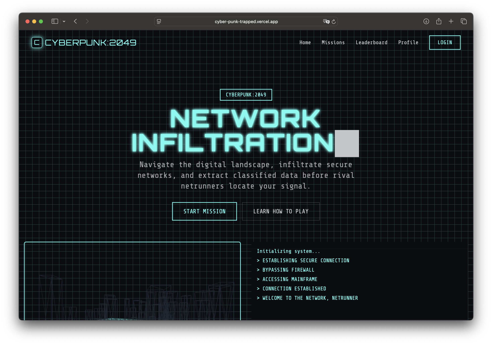
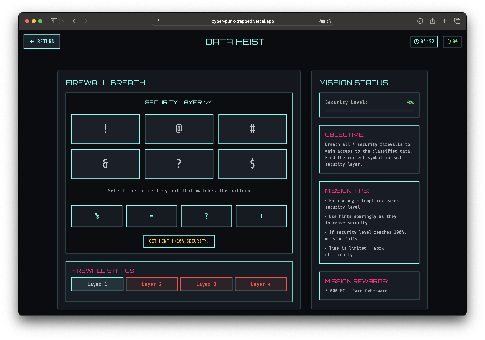
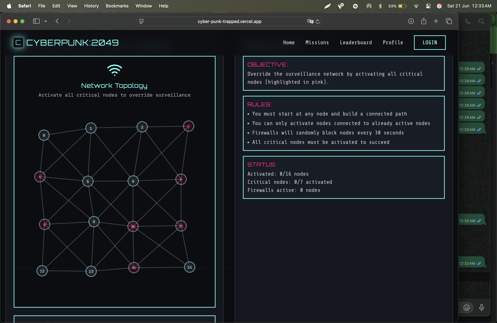
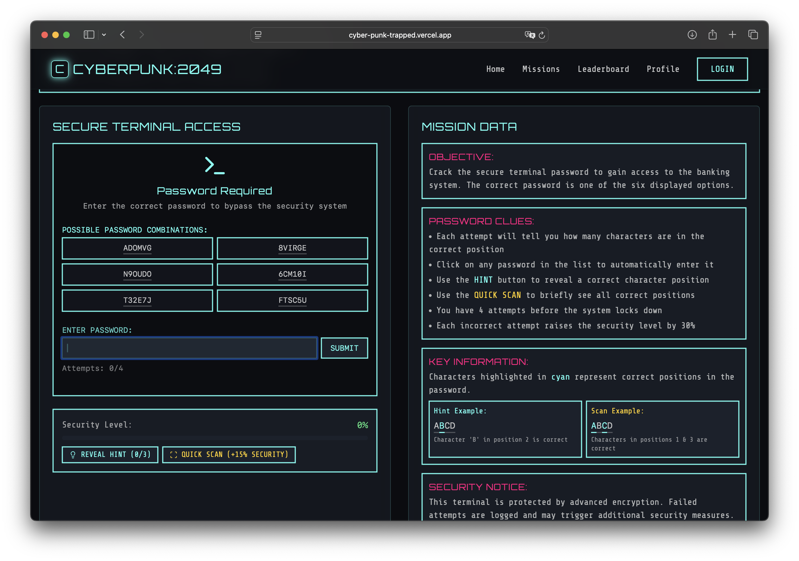

# Vite React Project

This is a modern React project built with Vite, TypeScript, and Shadcn UI components.

## Getting Started

1. Clone the repository
2. Install dependencies:
```bash
npm install
```

3. Start the development server:
```bash
npm run dev
```

## Available Scripts

- `npm run dev` - Start development server
- `npm run build` - Build for production
- `npm run build:dev` - Build for development
- `npm run preview` - Preview production build
- `npm run lint` - Run ESLint

## Features

- React 18
- TypeScript
- Vite
- Shadcn UI Components
- Tailwind CSS
- ESLint
- React Router
- React Query

## Screenshots

 

 

 
